# root-gov-dev

**Open Governance Module Testing Platform | 開放式治理模組測試平台**

---

## 🌟 Complete Technical Solution & Core Value Proposition | 完整技術方案與核心價值主張

### 🚀 Platform Positioning & Technical Vision | 平台定位與技術願景

**root-gov-dev** is a revolutionary **AI-driven open governance module testing platform** designed for next-generation digital governance. We combine cutting-edge artificial intelligence technology, modern software engineering practices, and innovative modular governance concepts to provide organizations with comprehensive governance technology solutions.

**root-gov-dev** 是一個革命性的 **AI 驅動開放式治理模組測試平台**，專為下一代數位治理而設計。我們結合前沿人工智慧技術、現代化軟體工程實踐，以及創新的模組化治理理念，為組織提供完整的治理科技解決方案。

---

## 💡 Core Value Proposition | 核心價值主張

### 🎯 Dramatically Lower Governance Innovation Barriers | 大幅降低治理創新門檻
- Traditional governance system development cycles reduced from months to weeks | 傳統治理系統開發週期從數月縮短至數週
- AI auto-generates module architecture, reducing 70% of repetitive development work | AI 自動生成模組架構，減少 70% 重複性開發工作
- Zero-foundation rapid deployment of enterprise-grade governance solutions | 零基礎快速搭建企業級治理解決方案

### ⚡ AI-Driven Intelligent Management | AI 驅動的智能化管理
- Automated module classification, dependency management, and conflict resolution | 自動化模組分類、依賴管理與衝突解決
- Intelligent recommendations for optimal module combinations and architectural design | 智能推薦最適合的模組組合與架構設計
- Machine learning-based governance decision optimization recommendations | 基於機器學習的治理決策優化建議

### 🔄 Adaptive Evolution Capabilities | 自適應演化能力
- Governance systems can autonomously optimize based on operational data | 治理系統能根據運行資料自主優化
- Closed-loop feedback mechanisms ensure continuous improvement | 閉環回饋機制確保持續改進
- Zero-downtime hot updates and version evolution | 零停機熱更新與版本演化

### 🛡️ Enterprise-Grade Security & Compliance | 企業級安全與合規
- Built-in SBOM automated security validation | 內建 SBOM 自動化安全驗證
- Compliant with trustworthy AI and cybersecurity regulations | 符合可信任 AI 與資安法規要求
- Complete audit trails and risk control mechanisms | 完整的稽核追蹤與風險管控機制

---

## 🌟 Technical Innovation Highlights | 技術創新亮點

Our platform is not just a tool, but a **technology accelerator** for governance technology:

我們的平台不僅僅是工具，更是治理科技的**技術加速器**:

- **Semantic-Driven Architecture | 語意驅動架構**: Ensures perfect collaboration and scalability between modules | 確保模組間完美協作與擴展
- **AI Collaborative Design | AI 協同設計**: Human-AI collaboration creates optimal governance solutions | 人機協作創造最佳治理方案
- **Holographic Observability | 全息觀測能力**: 360° system health monitoring | 360° 系統健康度監控
- **Open Ecosystem | 開放生態系統**: Rich third-party integration and extension capabilities | 豐富的第三方整合與擴展能力

---

## ⚡ Technical Features & Innovation Highlights | 技術特色與創新亮點

### 🤖 Intelligent Module Classification & Recommendation System | 智能化模組分類與推薦系統

#### AI-Driven Module Management | AI 驅動的模組管理
- **Automated Classification Algorithms | 自動分類演算法**: Multi-dimensional classification based on functionality, complexity, and dependencies | 基於功能、複雜度、依賴關係的多維度分類
- **Intelligent Tagging System | 智能標籤系統**: Automatic semantic tag generation and maintenance | 語意標籤自動生成與維護
- **Similar Module Detection | 相似模組檢測**: Prevent duplicate development and improve reusability | 避免重複開發，提升重用效率
- **Compatibility Scoring | 適配性評分**: AI assessment of module suitability and optimal combination recommendations | AI 評估模組適合度與推薦最佳組合

#### Technical Implementation | 技術實現
```yaml
Intelligent Module Analysis Engine | 模組智能分析引擎:
  - Machine Learning Classifiers | 機器學習分類器: RandomForest + XGBoost
  - Semantic Similarity Calculation | 語意相似度計算: BERT + Word2Vec
  - Dependency Analysis | 依賴關係分析: Graph Theory Algorithms | 圖論演算法
  - Recommendation System | 推薦系統: Collaborative Filtering + Content-based Recommendation | 協同過濾 + 內容推薦
```

---

### 📊 Full-Stack Observability & Monitoring Solutions | 全棧觀測與監控解決方案

#### Complete Observability Architecture | 完整可觀測性架構
- **Metrics Monitoring | 指標監控**: Prometheus + Grafana real-time dashboards | Prometheus + Grafana 實時儀表板
- **Log Aggregation | 日誌聚合**: Loki + Fluentd centralized log management | Loki + Fluentd 集中式日誌管理
- **Distributed Tracing | 分散式追蹤**: Jaeger + Tempo request chain tracing | Jaeger + Tempo 請求鏈路追蹤
- **Event Stream Processing | 事件流處理**: Kafka + EventBridge real-time event processing | Kafka + EventBridge 實時事件處理

#### Monitoring Capability Matrix | 監控能力矩陣

| Monitoring Type<br/>監控類型 | Tech Solution<br/>技術方案 | Response Time<br/>響應時間 | Data Retention<br/>資料保存 |
|------------------------------|----------------------------|----------------------------|----------------------------|
| System Metrics<br/>系統指標 | Prometheus | < 15s | 15 days<br/>15天 |
| Application Logs<br/>應用日誌 | Loki | < 30s | 30 days<br/>30天 |
| Trace Data<br/>追蹤資料 | Tempo | < 10s | 7 days<br/>7天 |
| Business Events<br/>業務事件 | Kafka | < 5s | 90 days<br/>90天 |

---

### 🔒 SBOM Automated Security Validation | SBOM 自動化安全驗證

#### Supply Chain Security Management | 供應鏈安全管理
- **Multi-format Support | 多格式支援**: SPDX, CycloneDX, SWID standard compatibility | SPDX、CycloneDX、SWID 標準相容
- **Automated Scanning Tools | 自動掃描工具**: Syft, Trivy, Grype integration | Syft、Trivy、Grype 整合
- **Vulnerability Database | 漏洞資料庫**: OSV.dev, NVD, GitHub Advisory real-time sync | OSV.dev、NVD、GitHub Advisory 即時同步
- **Risk Assessment Engine | 風險評估引擎**: CVSS scoring + business impact analysis | CVSS 評分 + 業務影響分析

#### Security Check Process | 安全檢查流程

```mermaid
flowchart TD
  Z[Semantic Intent<br/>語意驅動生成] --> A[Code Commit<br/>代碼提交]
  A --> B[SBOM Generate<br/>生成 SBOM]
  B --> C[SBOM Validate<br/>驗證 SBOM]
  C --> D[Governance Inject<br/>治理注入]
  D --> H[Module Inherited<br/>模組繼承]
  H --> E[CI/CD Trigger<br/>觸發 CI/CD]
  E --> F[Module Observed<br/>模組觀測]
  F --> G[Version Evolve<br/>模組演化]
  G --> I[SBOM Diff<br/>差異比對]
  I --> Z
```



---

### 📦 Semantic Version Control Strategy | 語意化版本控制策略

#### Intelligent Version Management | 智能版本管理
- **Breaking Change Detection | 破壞性變更檢測**: Automatic API compatibility analysis | API 相容性自動分析
- **Semantic Version Suggestions | 語意版本建議**: AI-recommended appropriate version number increments | AI 推薦適當的版本號遞增
- **Dependency Conflict Resolution | 依賴衝突解決**: Automatic detection and dependency version combination suggestions | 自動檢測並建議依賴版本組合
- **Rollback Strategy Optimization | 回滾策略優化**: Intelligent rollback based on impact scope | 基於影響範圍的智能回滾

#### Version Evolution Example | 版本演化示例

```json
{
  "version_analysis": {
    "current": "2.1.5",
    "proposed": "2.2.0",
    "changes": [
      {
        "type": "feature",
        "impact": "minor",
        "description": "Added AI conversation module | 新增 AI 對話模組"
      },
      {
        "type": "fix",
        "impact": "patch",
        "description": "Fixed memory leak | 修復記憶體洩漏"
      }
    ],
    "compatibility": "backward_compatible",
    "recommendation": "minor_bump"
  }
}
```

---

### 🚀 High-Performance Module Communication Architecture | 高效能模組通訊架構

#### Microservice Communication Optimization | 微服務通訊優化
- **Native gRPC Support | gRPC 原生支援**: High-performance binary protocol | 高效能二進位協議
- **GraphQL Integration | GraphQL 整合**: Flexible data query interface | 靈活的資料查詢介面
- **WebSocket Real-time Communication | WebSocket 實時通訊**: Real-time event push | 即時事件推送
- **Standardized REST API | REST API 標準化**: OpenAPI 3.0 specification | OpenAPI 3.0 規範

#### Performance Metrics | 效能指標
- **Latency Optimization | 延遲優化**: Average response time < 50ms | 平均響應時間 < 50ms
- **Throughput Enhancement | 吞吐量提升**: Support 10,000+ concurrent requests | 支援 10,000+ 併發請求
- **Bandwidth Savings | 頻寬節省**: Binary protocol reduces network transmission by 40% | 二進位協議減少 40% 網路傳輸

---

## 🎯 Solution Capability Matrix | 解決方案能力矩陣

### Applicable Scenarios & Customer Types | 適用場景與客戶類型

#### 🏛️ Government & Public Sector | 政府與公共部門
- **Digital Transformation Needs | 數位轉型需求**: Build modern citizen service platforms | 建置現代化公民服務平台
- **Regulatory Compliance Management | 法規遵循管理**: Automated compliance checking and report generation | 自動化合規檢查與報告生成
- **Cross-departmental Collaboration | 跨部門協作**: Unified governance framework and data exchange standards | 統一的治理框架與資料交換標準
- **Public Participation Platform | 公眾參與平台**: Transparent decision-making processes and opinion collection mechanisms | 透明化決策流程與意見收集機制

#### 🏢 Enterprise Organizations | 企業組織
- **ESG Governance | ESG 治理**: Automated tracking of Environmental, Social, and Governance indicators | 環境、社會、治理指標自動化追蹤
- **Risk Management & Control | 風險管控**: Real-time risk monitoring and early warning systems | 即時風險監控與預警系統
- **Internal Control & Compliance | 內控合規**: Digitalization of compliance processes and automated auditing | 法遵流程數位化與自動稽核
- **Shareholder Governance | 股東治理**: Transparent corporate governance and decision tracking | 透明化公司治理與決策追蹤

#### 🎓 Academic & Research Institutions | 學術與研究機構
- **Governance Research Platform | 治理研究平台**: Rapid validation of experimental governance models | 實驗性治理模式快速驗證
- **Academic Collaboration | 學術協作**: Cross-institutional research project management and result sharing | 跨機構研究專案管理與成果分享
- **Educational Applications | 教學應用**: Practical training platform for governance technology courses | 治理科技課程實務演練平台

---

### 🔌 Technical Integration Capabilities | 技術整合能力展示

#### Existing System Integration | 現有系統整合

```yaml
Integration Capabilities | 整合能力:
  ERP Systems | ERP系統:
    - SAP
    - Oracle
    - Microsoft Dynamics
  CRM Platforms | CRM平台:
    - Salesforce
    - HubSpot
    - Zoho
  Document Management | 文件管理:
    - SharePoint
    - Box
    - Google Workspace
  Identity Authentication | 身份認證:
    - Active Directory
    - Auth0
    - Okta
  Databases | 資料庫:
    - PostgreSQL
    - MongoDB
    - Redis
  Cloud Services | 雲端服務:
    - AWS
    - Azure
    - GCP
    - Alibaba Cloud | 阿里雲
```

#### API Compatibility Guarantee | API 相容性保證
- **RESTful API**: Complete OpenAPI 3.0 specification | 完整的 OpenAPI 3.0 規範
- **GraphQL Endpoints | GraphQL 端點**: Flexible data query and subscription | 靈活的資料查詢與訂閱
- **Webhook Support | Webhook 支援**: Real-time event notification mechanisms | 即時事件通知機制
- **Multi-language SDK Support | SDK 多語言支援**: Python, JavaScript, Java, C#, Go

---

### 💰 ROI & Expected Benefits | ROI 與效益預期

#### Quantifiable Benefit Indicators | 量化效益指標

| Benefit Type<br/>效益類型 | Expected Improvement<br/>預期提升 | Realization Time<br/>實現時間 | Sustained Benefits<br/>持續效益 |
|---------------------------|-----------------------------------|------------------------------|--------------------------------|
| Development Efficiency<br/>開發效率 | 500-1000% | 1-2 weeks<br/>1-2週 | Long-term<br/>長期 |
| Operational Costs<br/>營運成本 | Save 30-50%<br/>節省 30-50% | 1-3 months<br/>1-3個月 | Long-term<br/>長期 |
| Error Rate<br/>錯誤率 | Reduce 80%<br/>降低 80% | 2-4 weeks<br/>2-4週 | Long-term<br/>長期 |
| Compliance Efficiency<br/>合規效率 | Improve 300%<br/>提升 300% | 1 month<br/>1個月 | Long-term<br/>長期 |
| Decision Speed<br/>決策速度 | Improve 200%<br/>提升 200% | 2-6 months<br/>2-6個月 | Long-term<br/>長期 |

#### Qualitative Benefits | 質化效益
- **Significantly Enhanced Governance Transparency | 治理透明度大幅提升**: All decision processes are traceable and auditable | 所有決策流程可追蹤、可稽核
- **Enhanced Innovation Capability | 創新能力增強**: Rapid experimentation with new governance models | 快速試驗新的治理模式
- **Risk Controllability | 風險可控性**: Predictive analysis reduces the impact of unexpected events | 預測性分析降低突發事件影響
- **Team Collaboration Efficiency | 團隊協作效率**: Standardized processes improve cross-departmental collaboration | 標準化流程提升跨部門協作

---

## 🛠️ Implementation Capabilities & Service Support | 實作能力與服務支援

### ⚡ Rapid Deployment Capabilities | 快速部署能力

#### One-Click Deployment Solutions | 一鍵部署解決方案

```bash
# Docker Compose Quick Start | Docker Compose 快速啟動
curl -sSL https://get.root-gov.dev/install.sh | bash
docker-compose up -d

# Kubernetes Helm Deployment | Kubernetes Helm 部署
helm repo add root-gov https://charts.root-gov.dev
helm install root-gov root-gov/platform --namespace governance

# Cloud Managed Service | 雲端託管服務
terraform apply -var="environment=production"
```

#### Deployment Time Benchmarks | 部署時間基準
- **Local Development Environment | 本地開發環境**: Complete within 5 minutes | 5 分鐘內完成
- **Test Environment Deployment | 測試環境部署**: 10-15 minutes | 10-15 分鐘
- **Production Environment Deployment | 生產環境部署**: 30-45 minutes (including complete checks) | 30-45 分鐘（含完整檢查）
- **Multi-Cloud Deployment | 多雲部署**: 60-90 minutes (across three major cloud platforms) | 60-90 分鐘（跨三大雲端平台）

---

### 🔧 Custom Development Services | 客製化開發服務

#### Professional Service Capabilities | 專業服務能力
- **Requirements Analysis & Architecture Design | 需求分析與架構設計**: Senior solution architect team | 資深解決方案架構師團隊
- **Custom Module Development | 客製化模組開發**: Dedicated modules for specific business requirements | 針對特殊業務需求的專屬模組
- **Third-party System Integration | 第三方系統整合**: Legacy system modernization and transformation | Legacy 系統現代化改造
- **Performance Tuning & Optimization | 效能調優與最佳化**: System performance diagnosis and optimization recommendations | 系統效能診斷與優化建議

#### Development Service Levels | 開發服務等級

| Service Level<br/>服務級別 | Response Time<br/>回應時間 | Included Services<br/>包含內容 | Applicable Scenarios<br/>適用場景 |
|----------------------------|----------------------------|--------------------------------|----------------------------------|
| Standard Support<br/>標準支援 | 48 hours<br/>48小時 | Documentation guidance, community support<br/>文檔指導、社群支援 | General development needs<br/>一般開發需求 |
| Professional Service<br/>專業服務 | 24 hours<br/>24小時 | Expert consultation, code review<br/>專家諮詢、程式碼審查 | Enterprise-level projects<br/>企業級專案 |
| Enterprise Service<br/>企業服務 | 4 hours<br/>4小時 | Dedicated team, on-site support<br/>專屬團隊、現場支援 | Mission-critical systems<br/>關鍵任務系統 |

---

### 📚 Technical Support & Training | 技術支援與培訓

#### Multi-level Training System | 多層次培訓體系
- **Online Courses | 線上課程**: Complete learning path from beginner to advanced | 從入門到進階的完整學習路徑
- **Hands-on Workshops | 實作工作坊**: Hands-on experience and best practices sharing | hands-on 經驗與最佳實踐分享
- **Certification Program | 認證計劃**: Official technical certification and professional certificates | 官方技術認證與專業證書
- **Enterprise Training | 企業內訓**: Customized training courses and on-site guidance | 客製化培訓課程與現場指導

#### Support Channels | 支援管道

```yaml
Technical Support | 技術支援:
  Community Forum | 社群論壇:
    - Discord
    - GitHub Discussions
  Documentation Center | 文檔中心:
    - Complete API documentation and tutorials | 完整 API 文檔與教學
  Video Tutorials | 影片教學:
    - YouTube
    - Internal platform | 內部平台
  Real-time Consultation | 即時諮詢:
    - Slack expert groups | Slack 專家群組
  Emergency Support | 緊急支援:
    - 24/7 phone and email | 24/7 電話與 Email
```

#### SLA Commitments | SLA 承諾
- **System Availability | 系統可用性**: 99.9% uptime guarantee | 99.9% uptime 保證
- **Response Time | 回應時間**: Major issues responded within 4 hours | 重大問題 4 小時內回應
- **Resolution Time | 解決時間**: General issues resolved within 48 hours | 一般問題 48 小時內解決
- **Escalation Channel | 升級通道**: Priority support with direct access to technical team | 直達技術團隊的優先支援

---

## 📞 Contact Us | 聯絡我們

For more information or to schedule a demo, please contact us:

如需更多資訊或預約展示，請聯絡我們:

- **Website | 網站**: https://root-gov.dev
- **Email | 電子郵件**: contact@root-gov.dev
- **GitHub**: https://github.com/root-gov-dev

---

## 📄 License | 授權條款

This project is licensed under the MIT License - see the [LICENSE](LICENSE) file for details.

本專案採用 MIT 授權條款 - 詳見 [LICENSE](LICENSE) 檔案。

---

**© 2024 root-gov-dev. All rights reserved. | 版權所有。**
